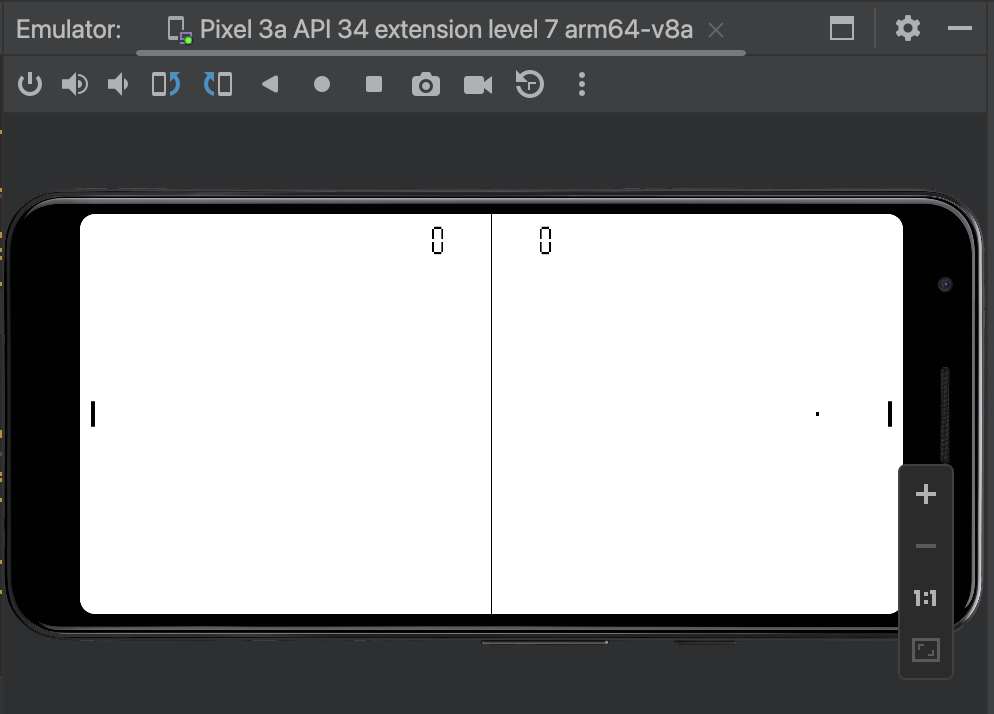

# The (Multiplatform-) OpenGL Tutorial

### Introduction
This tutorial is not about how to create another game engine, but more on how to create simple games on different platforms with almost no changes using OpenGL and C++.
For that reason the tutorial describes the boilerplate code needed on every platform and how to create a simple **Game** class in C++ which contains all the game logic.

### The example game: Pong
I choosed Pong as the the example game for this tutorial, because it just needs rectangles
to create it. In the follwing newsletters I will extend this by creating more complex and fun games, even in 3D!

I hope you like the tutorial and it brings some light in the different OpenGL versions, how to use them and more importantly how to implement it to become platform independent.

### Source Code
This repository contains the source code for the OpenGL Tutorial which is now on [Medium](https://rogerboesch.medium.com/)

### Articles

- *Article on Medium: Part VI - A 3D game (coming soon)*

- Article on Medium: [Part V - Refactoring: GameActivity and OpenGL ES 3 on Android](https://medium.com/@rogerboesch/the-opengl-tutorial-part-v-eae15f5bf5a0)
- Article on Medium: [Part IV - Android version](https://rogerboesch.medium.com/the-opengl-tutorial-part-iv-b2e044a21eea)
- Article on Medium: [Part III - iOS version](https://rogerboesch.medium.com/the-opengl-tutorial-part-iii-47adb24ec32e)
- Article on Medium: [Part II - Create a 2D game](https://rogerboesch.medium.com/the-opengl-tutorial-part-ii-28e89600565e)
- Article on Medium: [Part I - OpenGL Introduction](https://rogerboesch.medium.com/part-1-opengl-is-apple-killing-it-3508fda24a58)

---

### Videos

